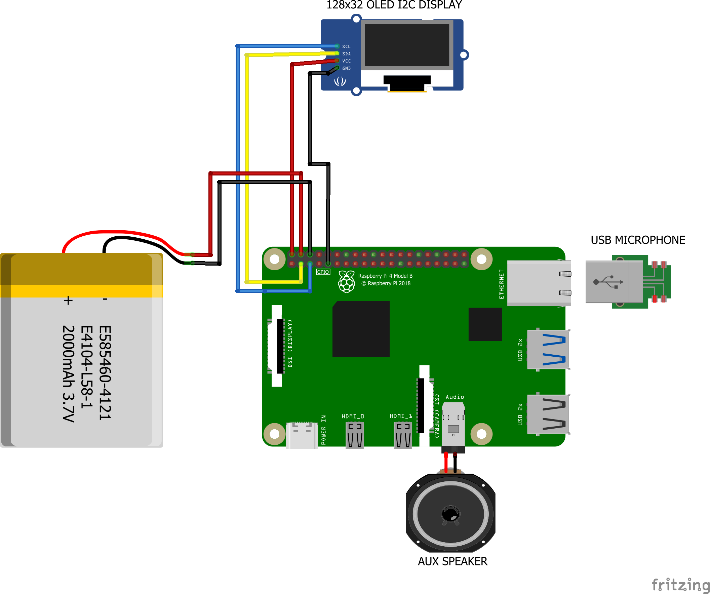
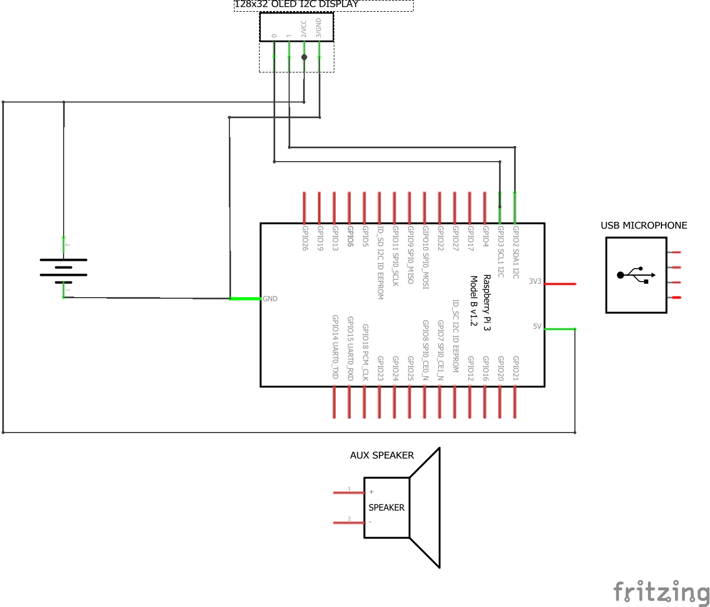

# ChatGPT Home
ChatGPT at home! Basically a better G**gle Nest Hub made with Raspberry Pi and OpenAI.

## Example Reclone script:
First initialize an environment variable with your OpenAI API Key.
```bash
export OPENAI_API_KEY="your_openai_api_key_here"
```
Then create a script outside the local repo folder to reclone the repo and start the service.
``` bash
#!/bin/bash

# Remove existing local repo if it exists
if [ -d "chatgpt-home" ]; then
    rm -rf chatgpt-home
fi

# Clone the GitHub repo
git clone https://github.com/judahpaul16/chatgpt-home.git

# Navigate to root of the local repo
cd chatgpt-home

# Create a virtual environment
python3 -m venv env

# Activate the virtual environment
source env/bin/activate

# Install Python dependencies
pip install -r requirements.txt

# Define the name of the systemd service
SERVICE_NAME="chatgpt-home.service"

# Check if the systemd service already exists
if ! systemctl list-units --type=service | grep -q "$SERVICE_NAME"; then
    echo "Systemd service $SERVICE_NAME does not exist. Creating and enabling it..."

    # Create a systemd service unit file
    cat <<EOF | sudo tee "/etc/systemd/system/$SERVICE_NAME" >/dev/null
[Unit]
Description=ChatGPT Home
After=network.target

[Service]
User=ubuntu
WorkingDirectory=/home/ubuntu/chatgpt-home
ExecStart=/home/ubuntu/chatgpt-home/app.py
Restart=always

[Install]
WantedBy=multi-user.target
EOF

    # Reload systemd
    sudo systemctl daemon-reload

    # Enable the service
    sudo systemctl enable "$SERVICE_NAME"

    echo "Systemd service $SERVICE_NAME created and enabled."
fi

# Start the service
sudo systemctl restart "$SERVICE_NAME"

echo ""
echo "Systemd service $SERVICE_NAME started."
echo ""
```
Be sure to make the script executable to run it
```bash
chmod +x reclone.sh
./reclone.sh
```

## Schematics
### Caution: Battery Connection

**IMPORTANT**: Before connecting the battery, ensure that the polarity is correct to avoid damage to your Raspberry Pi or other components. Disconnect power sources before making changes. This schematic does not include the SunFounder PiPower UPS HAT. Refer to [this link](https://a.co/d/0Jq1sHp) for details on integrating the PiPower UPS HAT.




## Documentation
[Raspberry Pi Docs](https://www.raspberrypi.com/documentation)
<br>
[GPIO Pinout](https://www.raspberrypi.com/documentation/computers/images/GPIO-Pinout-Diagram-2.png)
<br>
[OpenAI API Docs](https://beta.openai.com/docs/introduction)
<br>
[SpeechRecognition Docs](https://pypi.org/project/SpeechRecognition/)
<br>
[pyttsx3 Docs](https://pypi.org/project/pyttsx3/)
<br>
[Requests Docs](https://pypi.org/project/requests/)
<br>
[PortAudio Docs](http://www.portaudio.com/docs/v19-doxydocs/index.html)
<br>
[Python3 Docs](https://docs.python.org/3/)
<br>
[Fritzing Schematics](https://fritzing.org/)
